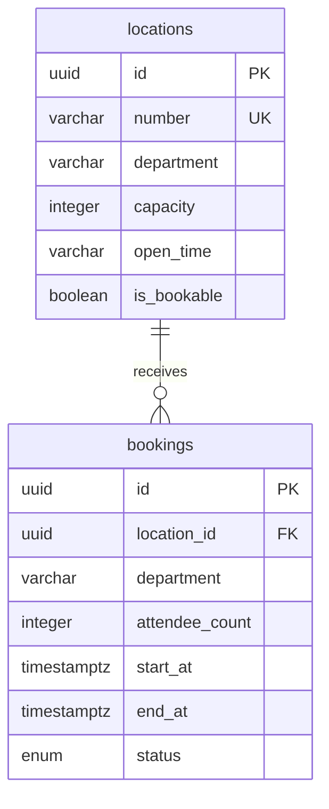

# Booking Database Design

## Table: `bookings`

| Column           | Type          | Notes                                                                    |
| ---------------- | ------------- | ------------------------------------------------------------------------ |
| `id`             | `uuid`        | Primary key, generated with `uuid_generate_v4()`                         |
| `location_id`    | `uuid`        | Required reference to `locations.id`                                     |
| `department`     | `varchar(80)` | Requesting department, must match the location department at create time |
| `attendee_count` | `integer`     | Must be positive and fit the location capacity                           |
| `start_at`       | `timestamptz` | Booking start instant                                                    |
| `end_at`         | `timestamptz` | Booking end instant, must be after `start_at`                            |
| `status`         | enum          | `confirmed` or `cancelled`; new bookings are `confirmed`                 |
| `created_at`     | `timestamptz` | Created timestamp                                                        |
| `updated_at`     | `timestamptz` | Updated timestamp                                                        |

## Constraints And Indexes

- Primary key on `id`.
- Foreign key from `location_id` to `locations.id` with `ON DELETE RESTRICT`.
- Check constraint: `attendee_count > 0`.
- Check constraint: `end_at > start_at`.
- Index on `location_id`.
- Indexes on `start_at`, `end_at`, and `status` for listing and overlap checks.
- Booking creation locks the target `locations` row with `FOR UPDATE` in a database transaction. The confirmed-overlap check and insert use the same transaction manager, so concurrent create requests for the same room are serialized before the overlap check runs.
- Runtime TypeORM schema synchronization is disabled for production. The app runs deterministic migrations from a clean database when `DB_MIGRATIONS_RUN=true`.
- PostgreSQL pool settings are explicit: `DB_POOL_MAX`, `DB_POOL_IDLE_TIMEOUT_MS`, and `DB_POOL_CONNECTION_TIMEOUT_MS`.

## Relationship

## Booking Validation Flow

The database enforces structural invariants. The service enforces assignment rules before save:

1. Location exists.
2. `endAt` is after `startAt`.
3. Location `isBookable` is `true`.
4. Booking department matches location department.
5. Attendee count is not greater than location capacity.
6. Requested wall-clock time is within the supported location open-time rule.
7. No confirmed booking overlaps the requested interval for the same location.

The service rejects bookings whose `startAt` and `endAt` do not fall on the same local calendar day before applying the room open-time window. This keeps assignment open-time rules day-scoped and rejects overnight or multi-day requests.

## Boundary And Lifecycle Rules

- New bookings are always `confirmed`.
- `cancelled` exists in the database enum for future lifecycle support, but there is no cancel/delete booking endpoint in this assignment scope.
- Overlap checks only consider `confirmed` bookings. A future cancel endpoint can set `status='cancelled'` without blocking that room's later time slots.
- Exact adjacency is allowed: one booking may end at the same instant another booking starts.
- Zero-length or negative-length intervals are rejected by both service validation and the database check constraint.
- Location deletion is leaf-only hard delete. The booking foreign key uses `ON DELETE RESTRICT`, so a location with existing bookings cannot be removed accidentally.

## Timezone Assumption

Booking DTOs must send ISO 8601 timestamps. Open-time validation uses the wall-clock date and time present in the submitted timestamp string instead of converting the request into the server timezone. This matches the assignment's human-readable room schedule fields and avoids server-location drift during review. Persisted `timestamptz` values still represent instants in PostgreSQL.

Supported open-time strings are:

- `Always open`
- `Mon to Fri (9AM to 6PM)`
- `Mon to Sat (9AM to 6PM)`
- `Mon to Sun (9AM to 6PM)`

Unsupported stored open-time strings fail closed with `400 Bad Request`.
