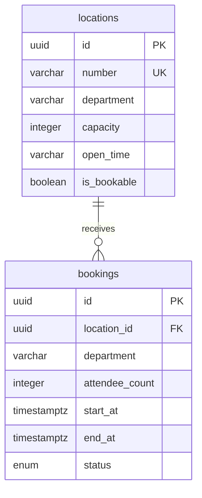

# Booking Database Design

## Table: `bookings`

| Column           | Type          | Notes                                                                    |
| ---------------- | ------------- | ------------------------------------------------------------------------ |
| `id`             | `uuid`        | Primary key, generated with `uuid_generate_v4()`                         |
| `location_id`    | `uuid`        | Required reference to `locations.id`                                     |
| `department`     | `varchar(80)` | Requesting department, must match the location department at create time |
| `attendee_count` | `integer`     | Must be positive and fit the location capacity                           |
| `start_at`       | `timestamptz` | Booking start instant                                                    |
| `end_at`         | `timestamptz` | Booking end instant, must be after `start_at`                            |
| `status`         | enum          | `confirmed` or `cancelled`; new bookings are `confirmed`                 |
| `created_at`     | `timestamptz` | Created timestamp                                                        |
| `updated_at`     | `timestamptz` | Updated timestamp                                                        |

## Constraints And Indexes

- Primary key on `id`.
- Foreign key from `location_id` to `locations.id` with `ON DELETE RESTRICT`.
- Check constraint: `attendee_count > 0`.
- Check constraint: `end_at > start_at`.
- Index on `location_id`.
- Indexes on `start_at`, `end_at`, and `status` for listing and overlap checks.

## Relationship

## Booking Validation Flow

The database enforces structural invariants. The service enforces assignment rules before save:

1. Location exists.
2. `endAt` is after `startAt`.
3. Location `isBookable` is `true`.
4. Booking department matches location department.
5. Attendee count is not greater than location capacity.
6. Requested wall-clock time is within the supported location open-time rule.
7. No confirmed booking overlaps the requested interval for the same location.
