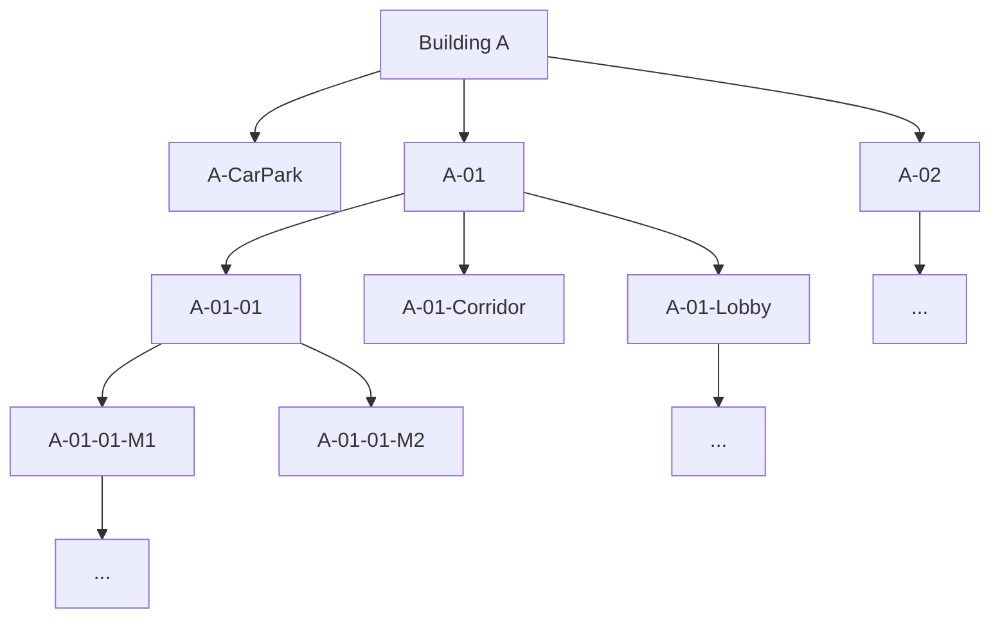

# Assignment Brief

## Background

The assignment asks for a RESTful API backend that manages building locations and room bookings.

The location data is hierarchical. A building can contain floors and other location nodes. A floor can contain rooms, corridors, lobbies, utility rooms, pantry areas, and other child locations.

Example hierarchy:

## Example Data

| Building | Location Name    | Location Number | Department | Capacity | Open Time               |
| -------- | ---------------- | --------------- | ---------- | -------- | ----------------------- |
| A        | Floor 1          | A-01            |            |          |                         |
| A        | Lobby Level1     | A-01-Lobby      |            |          |                         |
| A        | Meeting Room 1   | A-01-01         | EFM        | 10       | Mon to Fri (9AM to 6PM) |
| A        | Meeting Room 2   | A-01-02         | FSS        | 50       | Mon to Fri (9AM to 6PM) |
| A        | Corridor Floor 1 | A-01-Corridor   |            |          |                         |
| A        | Meeting Room 2   | A-01-03         | AVS        | 5        | Mon to Sat (9AM to 6PM) |
| B        | Floor 5          | B-05            |            |          |                         |
| B        | Utility Room     | B-05-11         | ASS        | 30       | Always open             |
| B        | Sanitary Room    | B-05-12         | EFM        | 10       | Mon to Fri (9AM to 6PM) |
| B        | Meeting Toilet   | B-05-13         | EFM        | 10       | Mon to Fri (9AM to 6PM) |
| B        | Genset Room      | B-05-14         | ASS        | 100      | Mon to Sun (9AM to 6PM) |
| B        | Pantry Floor 5   | B-05-15         |            |          |                         |
| B        | Corridor Floor 5 | B-05-Corridor   |            |          |                         |

## Required Technology

- Node.js
- NestJS
- TypeScript
- TypeORM
- PostgreSQL

## Expected Quality

- RESTful API design.
- Exception handling.
- Logging.
- Clean code.
- Documentation including system design and database design.
- Source code uploaded to a personal GitHub account.
